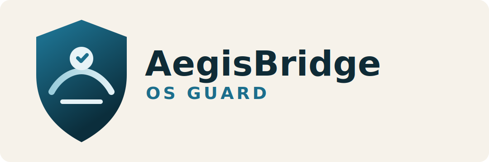

# AegisBridge OS Guard



Enterprise-ready Electron desktop application for monitoring endpoint posture and running safe diagnostics workflows.

## Features

- Monitoring Dashboard
  - Live endpoint count, latency, readiness, policy status, and memory telemetry.
- Diagnostics Bypass Workflow
  - Controlled diagnostics routine with ISO selection and read-only validation path.
- Windows Baseline Visibility
  - TPM and Secure Boot checks surfaced in a single operator view.
- Secure Desktop Bridge
  - Context-isolated IPC via preload with minimal exposed API.

## Project Structure

```text
.
|-- .github/
|   |-- ISSUE_TEMPLATE/
|   |-- workflows/
|-- assets/
|-- build/
|   |-- after-pack.js
|-- docs/
|-- download/
|-- src/
|   |-- main/
|   |   |-- main.js
|   |   |-- preload.js
|   |-- renderer/
|       |-- app.html
|       |-- app.js
|-- index.html
|-- script.js
|-- styles.css
|-- eslint.config.js
|-- SECURITY.md
|-- package.json
```

## Quick Start

### Prerequisites

- Node.js 20+
- npm 10+
- Windows (for native installer build)

### Install

```powershell
npm install
```

### Run in Development

```powershell
npm start
```

### Lint

```powershell
npm run lint
```

### Build Windows Installer

```powershell
npm run build:win
```

## Release and CI

- GitHub Actions workflow: .github/workflows/build.yml
- Trigger: on GitHub Release publication
- Output artifact: NSIS setup executable (*.exe)

## Security

See SECURITY.md for reporting procedures, secure build guidance, and trust model notes.

## License

MIT
